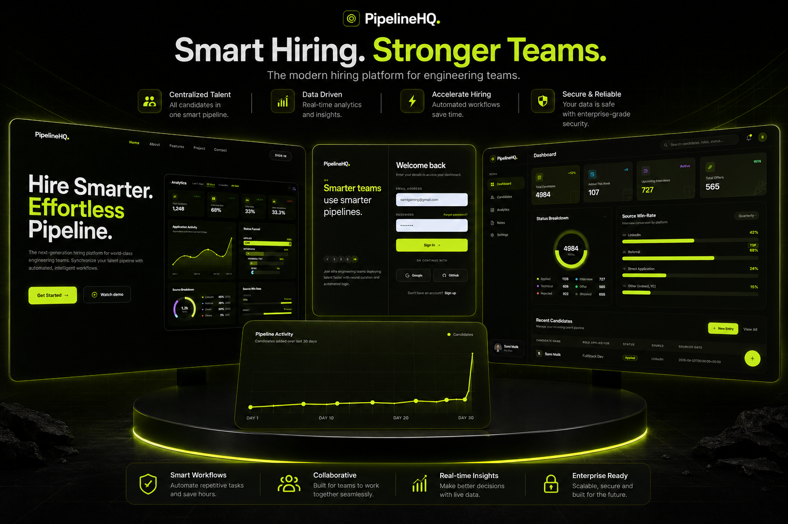
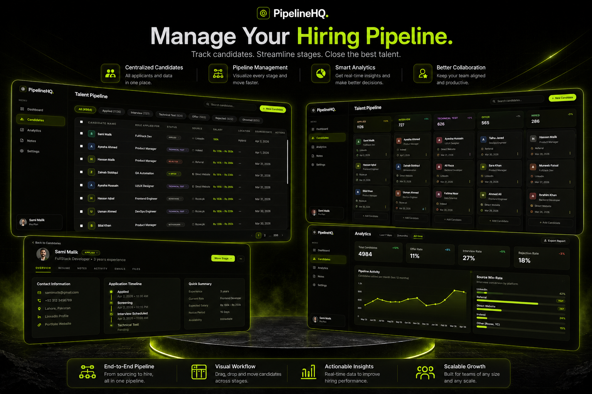

<div align="center">


<br />
<br />

<h1>PipelineHQ</h1>

<p><strong>A production-ready recruitment management platform, built with React, Node.js, and Supabase.</strong></p>

<p><em>Better pipelines, faster hires.</em></p>

<br />

[Features](#features) • [Tech Stack](#tech-stack) • [Project Structure](#project-structure) • [Getting Started](#getting-started) • [Demo](#demo) • [Screenshots](#screenshots)

<br />

</div>

---

## Features

**PipelineHQ** is a comprehensive, production-ready recruitment management application designed to streamline the hiring process. Built exclusively for recruiters and hiring managers, PipelineHQ provides a unified enterprise platform to manage candidate pipelines, coordinate job requisitions, analyze recruitment metrics, and securely manage team settings.

| Feature | Description |
|---|---|
| **Dashboard & Analytics** | Placement rates, time-to-hire stats, and six months of trend data at a glance |
| **Candidate Pipeline** | Drag-and-drop Kanban board with stages: New, Screening, Interview, Offer, Hired, Rejected |
| **Job Management** | Track open requisitions and keep the team focused on active postings |
| **Notes Workspace** | Log candidate impressions and follow-ups, synced and accessible anywhere |
| **MFA & OAuth** | TOTP-based two-factor authentication plus GitHub and Google SSO via Supabase Auth |
| **Settings & User Management** | Profile, security, and data privacy controls |

---

## Tech Stack

### Frontend — React

| Category | Technology |
|---|---|
| **Framework** | React 19 + Vite |
| **Styling** | Tailwind CSS |
| **State Management** | Zustand |
| **Animations** | GSAP |

### Backend — Node.js

| Category | Technology |
|---|---|
| **Server** | Express.js |
| **Architecture** | Routes → Middlewares → Controllers → Services |
| **Database** | Supabase (PostgreSQL) |
| **File Storage** | Supabase Storage |
| **Authentication** | Supabase Auth — TOTP MFA, GitHub & Google OAuth |

---

## Project Structure

### Frontend (`/src`)
```text
src/
├── assets/         # Static assets like SVGs and images
├── components/     # Reusable UI components (Dashboard, Shared, Settings, Auth)
├── data/           # Mock data and constants
├── hooks/          # Custom React hooks
├── lib/            # External library configurations (e.g., Supabase client)
├── pages/          # Full page layouts and views
├── store/          # Zustand state management stores
├── App.jsx         # Root frontend component and routing
└── index.css       # Tailwind entry point and root variables
```

### Backend (`/server`)
```text
server/
├── config/         # Environment and service configurations
├── controllers/    # API endpoint logic and payload handling
├── middlewares/    # Express middlewares (Auth, File upload, etc.)
├── routes/         # Express API route mapping
├── services/       # Core business logic and database interactions
└── server.js       # Express server entry point
```

---

## Getting Started

### Prerequisites

- [Node.js](https://nodejs.org/) `>=18.x`
- Active [Supabase](https://supabase.com/) instance with a configured database and storage bucket

---

### 1. Clone the Repository

```bash
git clone https://github.com/samimalikdev/PipelineHQ.git
cd PipelineHQ
```

---

### 2. Backend Setup

```bash
cd server
npm install
```

Create a `.env` file inside `/server`:

```env
PORT=5000
SUPABASE_URL=your_supabase_project_url
SUPABASE_SERVICE_KEY=your_supabase_service_role_key
```

Start the server:

```bash
npm run dev
```

> Server runs at `http://localhost:5000`

---

### 3. Frontend Setup

From the project root:

```bash
npm install
```

Create a `.env.local` file in the project root:

```env
VITE_SUPABASE_URL=your_supabase_project_url
VITE_SUPABASE_ANON_KEY=your_supabase_anon_key
```

Run the app:

```bash
npm run dev
```

---

## Demo

### Full App Walkthrough

<div align="center">
  <a href="https://youtu.be/KCyTxrQIVAE?si=ubFitOm8hPzxMeep">
    
  </a>
  <p><b>Click to watch the complete feature demonstration</b></p>
  <p><i>Dashboard, Kanban pipeline, Notes workspace, MFA flow, and more, all in action.</i></p>
</div>

---

## Screenshots

<p align="center">
  
</p>

<p align="center">
  
</p>


---

## License

Distributed under the MIT License. See [`LICENSE`](LICENSE) for details.

---

<div align="center">

First React app. Built from scratch. Shipped anyway.

If this helped you, drop a star — it means a lot.

</div>
